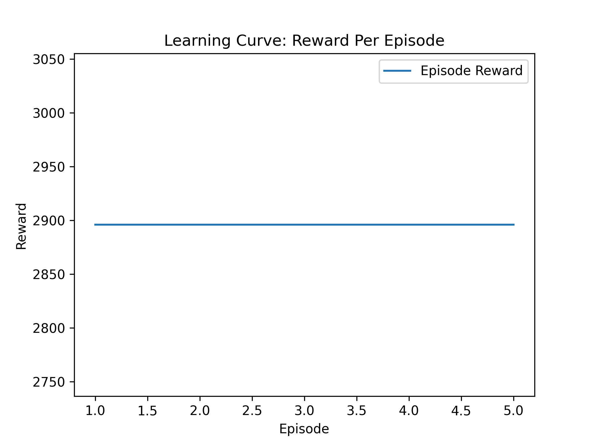
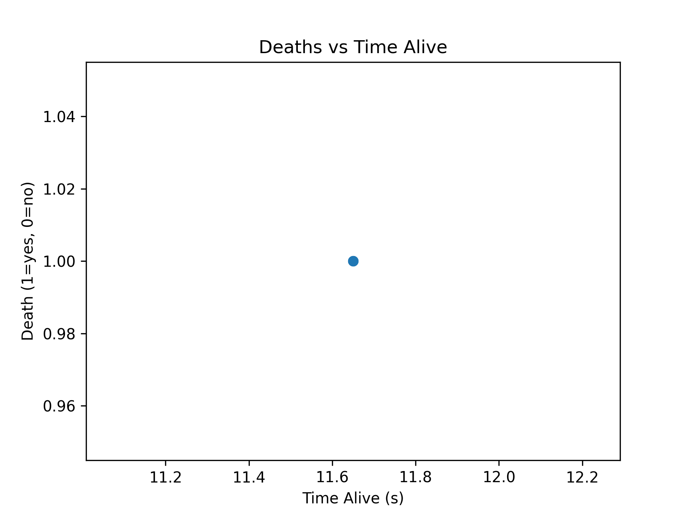

# Doodle Jump RL Environment

This repository implements a **custom Gymnasium-compatible environment** based on the classic game *Doodle Jump*, along with full reinforcement learning pipelines using **PPO** and **DQN**, human play mode, evaluation scripts, and visualization notebooks.

---

## Contributors

| Name             | Role / Contribution                  |
|------------------|-------------------------------------|
| **Sammak Ahmed** | Lead Developer |
| **Hailey D'Souza** | Developer |

## Project Structure

```

project_root/
│
├─ envs/                # Custom environment wrappers
│   └─ doodler_env.py
│
├─ src/                # Training / evaluation / gameplay scripts
│   ├─ train_doodler.py
│   ├─ eval_doodler.py
│   └─ human_play.py
│
├─ configs/            # YAML configs for algorithms, rewards, seeds, personas
├─ notebooks/          # Analysis & visualization notebooks
├─ models/             # Saved models
├─ logs/               # Training and evaluation logs
├─ plots/              # Generated plots (reward curves, score distributions, etc.)
└─ README.md

````

---

## Setup

1. Ensure Python 3.9+ is installed.
2. Install dependencies:

```bash
pip install -r requirements.txt
````

---

## Training an Agent

Use `src/train_doodler.py` to train a PPO or DQN model on the Doodle Jump environment.

### CLI Arguments

| Argument           | Description                                        | Default          |
| ------------------ | -------------------------------------------------- | ---------------- |
| `--algo`           | RL algorithm: `ppo` or `dqn`                       | `ppo`            |
| `--timesteps`      | Total training timesteps                           | `100000`         |
| `--seed`           | Random seed for reproducibility                    | `42`             |
| `--reward_persona` | Reward shaping persona: `survivor` or `aggressive` | `aggressive`     |
| `--logdir`         | Path to save logs                                  | `logs/doodler`   |
| `--modeldir`       | Path to save trained model                         | `models/doodler` |
| `--save_freq`      | Model save frequency                               | `10000`          |
| `--eval_freq`      | Evaluation frequency                               | `25000`          |
| `--n_envs`         | Number of parallel environments                    | `4`              |

### Examples

Train a PPO model with the **survivor** persona:

```bash
python src/train_doodler.py --algo ppo --timesteps 100000 --reward_persona survivor
```

Train a DQN model with the **aggressive** persona:

```bash
python src/train_doodler.py --algo dqn --timesteps 100000 --reward_persona aggressive
```

---

## Evaluating a Model

Evaluate a trained model and log performance metrics with `src/eval_doodler.py`.

### CLI Arguments

| Argument           | Description                            | Default                 |
| ------------------ | -------------------------------------- | ----------------------- |
| `--algo`           | Algorithm type: `ppo` or `dqn`         | `ppo`                   |
| `--model_path`     | Path to the saved model                | *required*              |
| `--episodes`       | Number of evaluation episodes          | `10`                    |
| `--render`         | Set to `1` to render episodes visually | `0`                     |
| `--csv_out`        | Path to save evaluation metrics CSV    | `logs/doodler_eval.csv` |
| `--reward_persona` | Reward persona used for evaluation     | `aggressive`            |

### Examples

Evaluate a PPO model visually:

```bash
python src/eval_doodler.py --algo ppo --model_path models/doodler/ppo_aggressive_final.zip --episodes 5 --render 1
```

Evaluate a DQN model headlessly:

```bash
python src/eval_doodler.py --algo dqn --model_path models/doodler/dqn_survivor_final.zip --episodes 10 --csv_out logs/eval_results.csv
```

---

## Human Play Mode

You can play the game manually to compare human performance against RL agents.

```bash
python src/human_play.py
```

### Controls

| Key | Action        |
| --- | ------------- |
| ←   | Move Left     |
| →   | Move Right    |
| Q   | Quit the Game |

---

## Environment Details

### Action Space

| Action | Behavior    |
| ------ | ----------- |
| `0`    | Move Left   |
| `1`    | Move Right  |
| `2`    | No Movement |

---

### Observation Space

The observation vector (~17D) contains:

* Doodler’s normalized horizontal (`dx`) and vertical (`dy`) velocities
* Up to 3 nearest platforms, each encoded as:

  * Relative horizontal offset (`-1` to `1`)
  * Relative vertical distance (`0` to `1`)
  * Platform type (`0` = static, `1` = moving)
  * Normalized width
  * Horizontal speed (if moving)

---

### Reward Function

| Event                                   | Reward                 |
| --------------------------------------- | ---------------------- |
| Height gained                           | `+5 × height_progress` |
| Landing on new platform                 | `+landing`             |
| Bouncing on same platform repeatedly    | `-0.01 × landings`     |
| Horizontal alignment with next platform | `+ up to 5.0`          |
| Falling off screen (death)              | `-death`               |
| Per timestep penalty                    | `-0.002`               |

**Reward Personas**:

* **Survivor** – Prioritizes safe, consistent progress and longevity.
* **Aggressive** – Rewards rapid height climbing and riskier strategies.

---

## Metrics Collected

The evaluation script logs the following metrics to CSV:

* **Average reward** per episode
* **Mean score**
* **Time alive (seconds)**
* **Platforms visited (coverage)**
* **Deaths per episode**
* **Height climbed**

---

## Analysis & Plots

* **Learning Curves:** Reward vs. Timesteps

* **Score Distributions:** Histogram of scores across episodes

* **Death Analysis:** Episodes to failure / time alive


---

## Artifacts

* **Models:** `models/` – Saved PPO and DQN checkpoints
* **Logs:** `logs/` – TensorBoard logs and evaluation CSVs
* **Plots:** `plots/` – Reward curves, score distributions, persona comparisons
* **Notebooks:** `notebooks/` – For further analysis and visualization

---

## Demo & Media

**PPO in Aggressive Reward Mode:**

**DQN in Aggressive Reward Mode:**

**Human Player:**


---

## Notes & Best Practices

* ✅ All experiments use fixed seeds for reproducibility
* ✅ Reward personas help compare strategic behavior differences
* ✅ All metrics are saved in machine-readable formats (CSV)
* ✅ The environment is fully Gymnasium-compatible and supports headless training
* ✅ Can be extended to new reward functions or action spaces with minimal changes
* ❌ Training is insufficient and agent doesn't consistently progress
* ❌ Agent doesn't learn and follows the same patterns each episode
* ❌ Inconsistencies and false graphs are due to agent training failure

---


